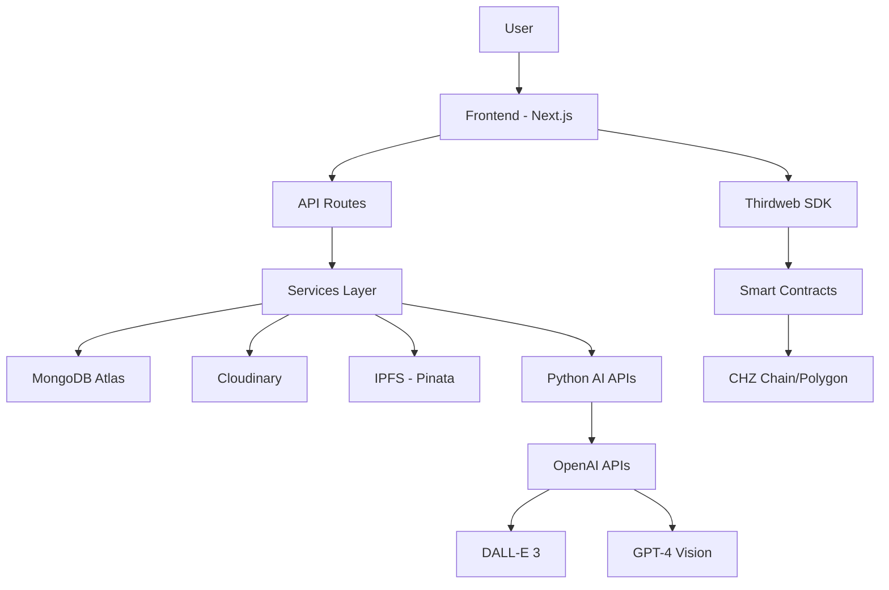

# 🏗️ CHZ Fan Token Studio - System Architecture

## 📋 **Overview**

CHZ Fan Token Studio is a **full-stack Web3 NFT platform** built with modern technologies to deliver scalable, secure, and user-friendly sports collectibles creation and trading.

---

## 🎯 **Architecture Layers**

```
┌─────────────────────────────────────────────────────────────────┐
│                           FRONTEND                              │
│  Next.js 14 + TypeScript + Tailwind CSS + Shadcn/UI           │
│                     (Vercel Deployment)                         │
├─────────────────────────────────────────────────────────────────┤
│                        WEB3 LAYER                               │
│     Thirdweb v5 + Reown AppKit + Smart Contracts               │
│                  (CHZ Chain + Polygon)                          │
├─────────────────────────────────────────────────────────────────┤
│                       BACKEND APIs                              │
│   Next.js API Routes + Python FastAPI (AI Generation)         │
│                    (Render Deployment)                          │
├─────────────────────────────────────────────────────────────────┤
│                       DATABASES                                 │
│           MongoDB Atlas + IPFS (Pinata) + Cloudinary           │
├─────────────────────────────────────────────────────────────────┤
│                     EXTERNAL SERVICES                           │
│        OpenAI (DALL-E 3 + GPT-4 Vision) + Thirdweb Engine     │
└─────────────────────────────────────────────────────────────────┘
```

---

## 🖥️ **Frontend Architecture**

### **Technology Stack**
```typescript
// Core Framework
Next.js 14 (App Router) + TypeScript + React 18

// Styling & UI
Tailwind CSS + Shadcn/UI + Framer Motion + GSAP

// Web3 Integration  
Thirdweb v5 + Reown AppKit + Wagmi + Viem

// State Management
React Hooks + Tanstack Query + Local Storage

// Image Handling
Next.js Image + Cloudinary CDN + IPFS
```

### **Component Architecture**
```
src/
├── app/                          # Next.js App Router
│   ├── api/                      # API endpoints (13+ documented)
│   ├── admin/                    # Admin dashboard
│   ├── marketplace/              # Marketplace pages
│   ├── launchpad/               # Collection deployment
│   ├── badges/                  # Badge creation
│   ├── jerseys/                 # Jersey creation
│   └── stadiums/                # Stadium creation
├── components/
│   ├── ui/                      # Shadcn/UI components (44 files)
│   ├── marketplace/             # Marketplace components (38 files)
│   ├── editor/                  # Content creation editors
│   ├── admin/                   # Admin panel components
│   └── layouts/                 # Layout components
├── hooks/                       # Custom React hooks (17 files)
├── lib/                         # Utilities and services
│   ├── services/                # Business logic services
│   └── thirdweb/               # Web3 configurations
└── types/                       # TypeScript definitions
```

### **Key Features**
- **🎨 AI Content Generation**: Jersey, Stadium, Badge editors with vision analysis
- **🛒 Complete Marketplace**: Real-time data, filtering, search, trading
- **🔧 Admin Dashboard**: Analytics, moderation, user management
- **📱 Responsive Design**: Mobile-first approach with touch optimization
- **🌐 Web3 Integration**: Gasless minting, multi-chain support

---

## ⚙️ **Backend Architecture**

### **API Layer Structure**
```
Next.js API Routes (TypeScript)
├── /api/marketplace/            # Trading & listings
├── /api/launchpad/             # Collection deployment
├── /api/upload/                # Cloudinary integration
├── /api/ipfs-upload/           # IPFS storage
├── /api/generate/              # AI content generation
├── /api/users/                 # User management
├── /api/engine/                # Thirdweb Engine
├── /api/jerseys/               # Jersey NFTs
├── /api/stadiums/              # Stadium NFTs
├── /api/badges/                # Badge NFTs
├── /api/teams/                 # Team configurations
├── /api/vision-test/           # Vision analysis
├── /api/vision-prompts/        # AI prompts
└── /api/docs/                  # Swagger documentation

Python FastAPI (AI Generation)
├── main_unified.py             # Unified AI service
├── vision_test_api.py          # Vision analysis
├── stadium_vision_dalle3.py    # Stadium generation
└── badge_api.py                # Badge generation
```

### **Service Layer**
```typescript
// Core Services
MarketplaceService              # Trading logic
IPFSService                     # Decentralized storage  
CloudinaryService              # Image upload/optimization
VisionAnalysisService          # AI image analysis
LaunchpadService               # Collection deployment
AdminService                   # Management operations

// Data Access Layer
MongoDB Collections:
├── jerseys                    # Jersey NFTs
├── stadiums                   # Stadium NFTs  
├── badges                     # Badge NFTs
├── launchpad_collections      # Deployed collections
├── launchpad_collection_mints # Minted NFTs
├── custom_collections         # Custom collections
└── users                      # User profiles
```

---

## 🌐 **Web3 & Blockchain Layer**

### **Smart Contract Integration**
```typescript
// Thirdweb v5 Contracts
NFT Collection (ERC-721)        # Individual NFTs
Edition Drop (ERC-1155)         # Multiple editions
Marketplace V3                  # Trading contract

// Supported Networks
CHZ Chain (88888/88882)         # Primary network
Polygon (137/80002)             # Secondary network

// Key Features
Gasless Minting                 # Sponsored transactions
Multi-chain Support             # Cross-chain compatibility
Royalty Management              # Creator earnings
Allowlist Support               # Token-gated access (50% implemented)
```

### **Web3 Integration Pattern**
```typescript
// Wallet Connection
Reown AppKit (WalletConnect v2) # Modern wallet integration
Thirdweb v5 Hooks              # React Web3 hooks
Wagmi + Viem                   # Ethereum interactions

// Transaction Flow
1. User connects wallet        → Reown AppKit
2. User creates content        → AI Generation APIs  
3. Content uploaded to IPFS    → Pinata service
4. Metadata prepared           → MongoDB storage
5. NFT minted (gasless)        → Thirdweb Engine
6. Available in marketplace    → Real-time updates
```

---

## 🗄️ **Database Architecture**

### **MongoDB Atlas Schema**
```javascript
// Primary Collections
jerseys: {
  _id: ObjectId,
  name: String,
  imageUrl: String,
  creatorWallet: String,
  status: "Approved" | "Pending" | "Rejected",
  team: String,
  tags: [String],
  metadata: Object,
  createdAt: Date
}

launchpad_collections: {
  _id: ObjectId,
  name: String,
  contractAddress: String,
  minted: Number,
  totalSupply: Number,
  priceInMatic: Number,
  category: String,
  status: "draft" | "pending_launchpad" | "upcoming" | "active" | "hidden" | "ended" | "rejected",
  launchDate: Date,
  endDate: Date,
  type: "launchpad",
  marketplaceEnabled: Boolean,
  createdAt: Date
}

launchpad_collection_mints: {
  _id: ObjectId,
  launchpadCollectionId: ObjectId,
  tokenId: Number,
  name: String,
  marketplace: {
    isListed: Boolean,
    contractAddress: String,
    verified: Boolean,
    canTrade: Boolean
  }
}

users: {
  _id: ObjectId,
  walletAddress: String,
  email: String,
  profileImage: String,
  createdNFTs: [ObjectId],
  isAdmin: Boolean
}
```

### **Data Flow Pattern**
```
1. Content Creation    → MongoDB (metadata + refs)
2. Image Upload        → Cloudinary (optimized delivery)
3. Metadata Upload     → IPFS (decentralized storage)
4. NFT Minting         → Blockchain (ownership record)
5. Marketplace Listing → MongoDB (trading data)
```

---

## 🔧 **External Services Integration**

### **AI & Content Generation**
```
OpenAI Services:
├── DALL-E 3              # Primary image generation
├── GPT-4 Vision          # Image analysis
└── GPT-4                 # Text processing

Service Integration:
├── Cloudinary            # Image optimization & CDN
├── Pinata IPFS           # Decentralized storage
└── Thirdweb Engine       # Gasless transactions
```

### **Web3 Infrastructure**
```
Thirdweb Platform:
├── Smart Contracts       # Pre-audited contracts
├── Engine Service        # Gasless minting
├── SDK v5                # Web3 interactions
└── Admin Dashboard       # Contract management

Network Support:
├── CHZ Chain             # Primary (Mainnet: 88888, Testnet: 88882)
├── Polygon              # Secondary (Mainnet: 137, Testnet: 80002)
└── Multi-chain Ready     # Extensible architecture
```

---

## 🔐 **Security Architecture**

### **Authentication & Authorization**
```typescript
// Wallet-based Authentication
Primary: Wallet signature verification
Secondary: Email/social login support
Admin: Wallet + email dual verification

// Authorization Levels
Public: View marketplace, create content
User: Mint NFTs, trade, manage profile  
Admin: Moderation, analytics, system management
Super Admin: Full system control
```

### **Security Measures**
```
Frontend Security:
├── Input validation & sanitization
├── XSS protection (Next.js built-in)
├── CSRF protection
└── Environment variable isolation

Backend Security:  
├── API rate limiting
├── Request validation
├── MongoDB injection prevention
└── Secure API key management

Smart Contract Security:
├── Thirdweb audited contracts
├── Permission-based minting
├── Royalty enforcement
└── Marketplace escrow
```

---

## 📊 **Performance & Scalability**

### **Frontend Optimization**
```
Next.js Features:
├── Static Site Generation (SSG)
├── Server-Side Rendering (SSR)  
├── Image optimization
├── Code splitting
└── Bundle optimization

Caching Strategy:
├── Cloudinary CDN (images)
├── Browser caching (static assets)
├── API response caching
└── MongoDB connection pooling
```

### **Backend Scalability**
```
Architecture Patterns:
├── Microservices (separated AI APIs)
├── Service layer abstraction
├── Database indexing
├── Connection pooling
└── Error handling & retries

Deployment Strategy:
├── Vercel (Frontend) - Global CDN
├── Render (Python APIs) - Auto-scaling
├── MongoDB Atlas - Managed scaling
└── IPFS (Pinata) - Distributed storage
```

---

## 🚀 **Deployment Architecture**

### **Production Environment**
```
Frontend (Vercel):
├── Next.js SSR/SSG
├── Global CDN distribution
├── Automatic deployments
└── Environment management

Backend (Render):
├── Python FastAPI services
├── Auto-scaling instances
├── Health monitoring
└── Log aggregation

Database (MongoDB Atlas):
├── Managed MongoDB cluster
├── Automatic backups
├── Global distribution
└── Performance monitoring
```

### **Development Workflow**
```
Local Development:
├── Next.js dev server (3000)
├── Python APIs (8000, 8002)
├── MongoDB local/Atlas
└── Environment variables

CI/CD Pipeline:
├── Git push triggers build
├── Automated testing
├── Deployment to staging
└── Production deployment
```

---

## 🎯 **Key Architectural Decisions**

### **Technology Choices**
1. **Next.js 14** - Full-stack React framework with excellent DX
2. **Thirdweb v5** - Modern Web3 SDK with gasless support  
3. **MongoDB Atlas** - Flexible document database for NFT metadata
4. **DALL-E 3** - Superior AI image generation over Stable Diffusion
5. **Reown AppKit** - Modern wallet connection with WalletConnect v2

### **Design Patterns**
1. **Service Layer Pattern** - Business logic separation
2. **Repository Pattern** - Data access abstraction
3. **Factory Pattern** - Contract instance creation
4. **Observer Pattern** - Real-time updates
5. **Middleware Pattern** - Request processing pipeline

### **Scalability Considerations**
1. **Stateless Design** - Horizontal scaling capability
2. **Microservices** - Independent service scaling
3. **CDN Integration** - Global content delivery
4. **Database Optimization** - Proper indexing and queries
5. **Caching Strategy** - Multi-layer caching implementation

---

## 📈 **Monitoring & Analytics**

### **System Monitoring**
```
Application Metrics:
├── API response times
├── Error rates & logging
├── User engagement
└── Transaction success rates

Infrastructure Metrics:
├── Server performance
├── Database performance  
├── CDN hit rates
└── Storage usage

Business Metrics:
├── NFT creation rates
├── Marketplace activity
├── User growth
└── Revenue tracking
```

---

## 🔄 **Data Flow Diagram**



---

This architecture ensures **scalability**, **security**, and **maintainability** while delivering a **premium user experience** for sports collectible creation and trading.
