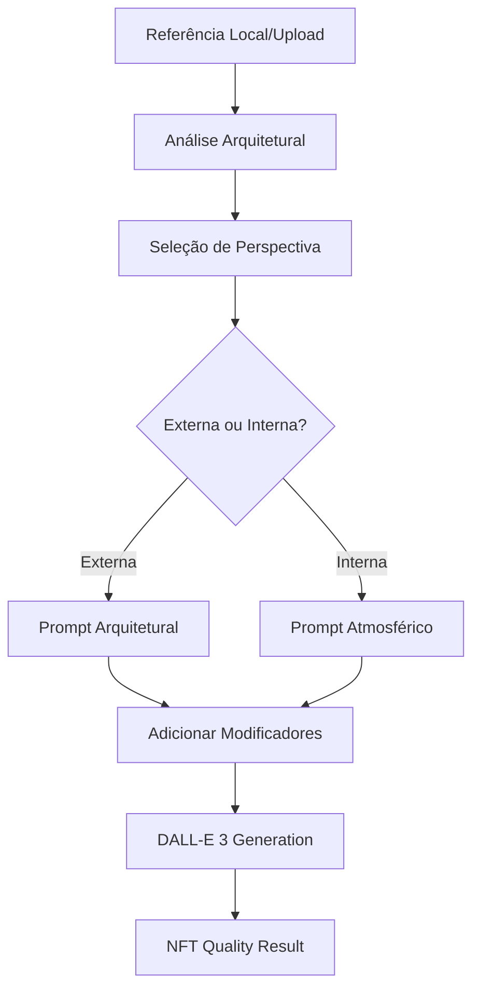

# Stadium Premium NFT Prompts System

## 📋 Visão Geral

Sistema de prompts premium integrado para geração de estádios com qualidade NFT profissional. O sistema utiliza prompts base estruturados que garantem consistência e alta qualidade nas gerações, com suporte para **perspectivas externa e interna**.

## 🎯 Prompts Base Premium

### 🏟️ Visão Externa (Arquitetural)
```python
STADIUM_NFT_BASE_PROMPT_EXTERNAL = """
Create a stunning, hyperrealistic stadium NFT artwork with premium quality details:

ARCHITECTURAL DESIGN:
- {architectural_analysis}
- Premium materials: brushed steel, reflective glass panels, LED-integrated concrete
- Multiple tiers with luxury VIP sections
- Retractable roof with geometric patterns

VISUAL EXCELLENCE:
- 8K resolution quality rendering
- Dramatic lighting: golden hour sunset with stadium lights beginning to glow
- Cinematic composition with slight aerial perspective
- Perfect symmetry and architectural precision

PREMIUM NFT AESTHETICS:
- Hyperrealistic 3D rendering style
- Rich color palette: deep blues, warm golds, pristine whites
- Atmospheric effects: subtle light rays, realistic shadows
- Crystal-clear details in every surface and texture

Style: Photorealistic architectural rendering, premium NFT artwork quality, cinematic lighting
"""
```

### 🎭 Visão Interna (Atmosfera)
```python
STADIUM_NFT_BASE_PROMPT_INTERNAL = """
A high-resolution, ultra-realistic 8K digital rendering of a packed football stadium during a night match. 
The scene is viewed from an elevated angle behind the goal, capturing the interior structure and crowd atmosphere. 
The architecture includes a curved horseshoe or circular seating layout, illuminated with powerful floodlights. 

ARCHITECTURAL INTEGRATION:
- {architectural_analysis}
- Authentic stadium interior structure with premium materials
- Curved seating tiers with luxury VIP sections visible
- Professional floodlighting system creating dramatic illumination

CROWD AND ATMOSPHERE:
- Fans fill the stands, creating a vibrant mosaic of team colors
- Supporters wear matching team colors creating visual unity
- Banners and flags wave above the crowd, adding movement and energy
- Realistic crowd density with authentic fan behavior

PREMIUM NFT QUALITY:
- Ultra-realistic 8K rendering quality
- Atmospheric lighting highlights the passion and grandeur
- Shadows, color reflections, and cinematic depth of field
- Perfect balance of crowd energy and architectural beauty

Style: Hyperrealistic | Stadium interior | Premium NFT artwork | Cinematic lighting | Crowd-focused
"""
```

## 🎨 Variações de Estilo com Perspectivas

### Realistic
- **External**: Foco em realismo arquitetural fotográfico
- **Internal**: Atmosfera realista com torcida e campo

### Cinematic
- **External**: Perspectiva cinematográfica épica, ângulos dramáticos
- **Internal**: Cenas de multidão com qualidade de filme, profundidade de campo

### Dramatic
- **External**: Alto contraste, efeitos climáticos, iluminação intensa
- **Internal**: Silhuetas dramáticas da torcida, feixes de luz cortando o estádio

## 🌟 Modificadores Disponíveis

### Perspectiva (NOVO!)
- **External**: Visão externa mostrando grandeza arquitetural
- **Internal**: Visão interna capturando atmosfera da torcida e ação do campo
- **Mixed**: Perspectiva dinâmica combinando beleza arquitetural e energia da torcida

### Atmosfera
- **Packed**: Estádio lotado com energia elétrica
- **Half Full**: Moderadamente cheio, energia balanceada
- **Empty**: Vazio, mostrando beleza arquitetural pura

### Horário
- **Day**: Luz natural brilhante, céu azul claro
- **Night**: Holofotes em glória total, atmosfera noturna
- **Sunset**: Magia da hora dourada, cores quentes

### Clima
- **Clear**: Tempo perfeito, condições atmosféricas pristinas
- **Dramatic**: Céu dramático com formações interessantes
- **Cloudy**: Céu nublado com iluminação difusa

## 🔧 Funcionamento Técnico Aprimorado

### 1. Seleção Inteligente de Prompt
```python
def build_enhanced_stadium_prompt(
    architectural_analysis: str,
    style: str = "realistic",
    perspective: str = "external",  # NOVO!
    atmosphere: str = "packed",
    time_of_day: str = "day",
    weather: str = "clear",
    custom_additions: str = ""
):
    # Seleciona prompt baseado no estilo + perspectiva
    prompt_key = f"{style}_{perspective}"
    # Ex: "cinematic_internal", "dramatic_external"
```

### 2. Matriz de Combinações
| Estilo | Externa | Interna |
|--------|---------|---------|
| **Realistic** | Arquitetura fotográfica | Atmosfera realista |
| **Cinematic** | Épico cinematográfico | Multidão cinematográfica |
| **Dramatic** | Contraste arquitetural | Energia dramática |

### 3. Exemplos de Uso

**Visão Externa Cinematográfica:**
```python
external_prompt = build_enhanced_stadium_prompt(
    architectural_analysis="Modern stadium with curved roof",
    style="cinematic",
    perspective="external",
    atmosphere="packed",
    time_of_day="sunset"
)
```

**Visão Interna Dramática:**
```python
internal_prompt = build_enhanced_stadium_prompt(
    architectural_analysis="Classic stadium with distinctive seating",
    style="dramatic",
    perspective="internal",
    atmosphere="packed",
    time_of_day="night"
)
```

## 📊 Fluxo de Geração Atualizado



## 🎯 Resultados Esperados por Perspectiva

### 🏟️ Visão Externa
- **Foco**: Grandeza arquitetural
- **Elementos**: Estrutura externa, materiais premium, skyline
- **Estética**: Majestosa, imponente, icônica
- **Ideal para**: Showcase arquitetural, coleções de estádios

### 🎭 Visão Interna
- **Foco**: Energia da torcida e atmosfera
- **Elementos**: Multidão, campo, arquibancadas, floodlights
- **Estética**: Vibrante, energética, emocional
- **Ideal para**: Momentos de jogo, experiência do torcedor

## 🚀 Integração Completa

### Frontend (StadiumEditor.tsx)
- Seletor de perspectiva integrado
- Interface responsiva com preview
- Parâmetros dinâmicos baseados na perspectiva

### Backend (stadium_reference_api.py)
- Sistema de prompts duplo (externa/interna)
- Análise arquitetural adaptativa
- Geração otimizada por perspectiva

### API Endpoints
- `/generate-from-reference` - Com suporte a perspectiva
- `/generate-custom` - Perspectiva customizável
- Parâmetro `perspective`: "external", "internal", "mixed"

## 💰 Estrutura de Custos
- **Análise**: $0.01 (OpenRouter GPT-4o-mini)
- **Geração Standard**: $0.04 (1024x1024)
- **Geração HD**: $0.08 (1024x1792)
- **Total médio**: $0.05-0.09 por estádio

## 📈 Benefícios das Perspectivas Duplas

1. **Versatilidade**: Atende diferentes necessidades (arquitetura vs atmosfera)
2. **Qualidade**: Prompts específicos para cada tipo de resultado
3. **Experiência**: Usuário escolhe o foco desejado
4. **Colecionabilidade**: Permite séries complementares (externa + interna)
5. **Profissionalismo**: Resultados especializados por categoria

## 🔄 Roadmap Futuro

- [ ] **Perspectiva Aérea**: Vista de drone/satélite
- [ ] **Perspectiva Campo**: Do nível do gramado
- [ ] **Perspectiva Tribuna**: Da arquibancada
- [ ] **Modo Comparativo**: Gerar externa + interna simultaneamente
- [ ] **Animações**: Transições entre perspectivas
- [ ] **Realidade Virtual**: Integração com metaverso

---

**Status**: ✅ Implementado e Funcional
**Versão**: 2.0.0 - Perspectivas Duplas
**Última Atualização**: Hoje

### 🎉 Novidades da v2.0.0:
- ✅ Prompts premium para visão interna
- ✅ Seletor de perspectiva no frontend
- ✅ Sistema inteligente de prompt building
- ✅ Matriz de combinações estilo + perspectiva
- ✅ Documentação completa atualizada 